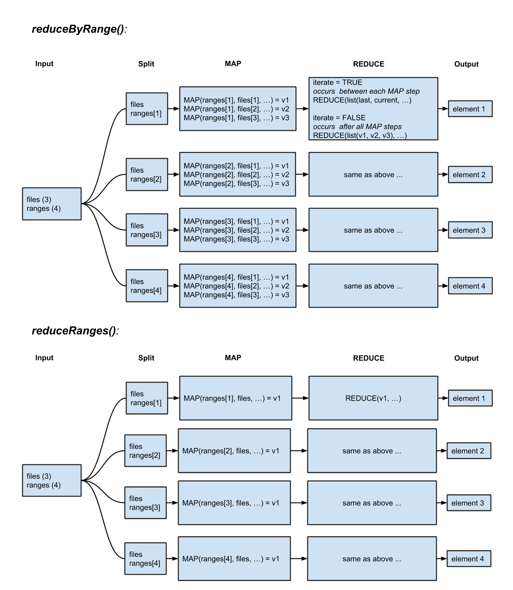
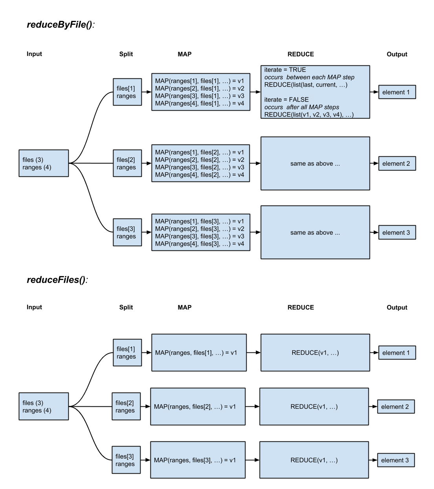

---
title: "Introduction to GenomicFiles"
author: Valerie Obenchain,Michael Love,Lori Shepherd,Martin Morgan
date: March 04, 2023
package: GenomicFiles
vignette: >
  %\VignetteIndexEntry{GenomicFiles}
  %\VignetteEngine{knitr::rmarkdown}
  %\VignetteEncoding{UTF-8}
output:
  BiocStyle::html_document
---

# Introduction

This vignette illustrates how to use the `GenomicFiles` package for distributed computing across files. The functions in `GenomicFiles` manipulate and combine data subsets via two user-supplied functions, `MAP` and `REDUCE`. These are similar in spirit to `Map` and `Reduce` in base R. Together they provide a flexible interface to extract, manipulate, and combine data. Both functions are executed in the distributed step, which means results are combined on a single worker, not across workers.

We assume the reader has some previous experience with R and with basic manipulation of ranges objects such as `GRanges` and `GAlignments` and file classes such as `BamFile` and `BigWigFile`. See the vignettes and documentation in `GenomicRanges`, `GenomicAlignments`, `Rsamtools` and `rtracklayer` for an introduction to these classes.

The `GenomicFiles` package is available at bioconductor.org and can be downloaded via `BiocManager::install`. 

```
> if (!require("BiocManager"))
+ install.packages("BiocManager")
> BiocManager::install("GenomicFiles")
```
# Quick Start

offers functions for the parallel extraction and combination of data
subsets. A user-defined MAP function extracts and manipulates data while
an optional REDUCE function consolidates the output of MAP.
```
> library(GenomicFiles)
```
Ranges can be a GRanges, GRangesList or GenomicFiles class.
```
> gr <- GRanges("chr14", IRanges(c(19411500 + (1:5)*20), width=10))
```
File are supplied as a character vector or list of *File classes such as BamFile, BigWigFile
etc.
```
> library(RNAseqData.HNRNPC.bam.chr14)
> fls <- RNAseqData.HNRNPC.bam.chr14_BAMFILES
```

The MAP function extracts and manipulates data subsets. Here we compute pileups for a
given range and file.
```
> MAP <- function(range, file, ...) {
+ requireNamespace("Rsamtools")
+ Rsamtools::pileup(file, scanBamParam=Rsamtools::ScanBamParam(which=range))
 }
 ```

reduceByFile sends each file to a worker where MAP is applied to each file / range combination. When summarize=TRUE the output is a SummarizedExperiment object.
```
> se <- reduceByFile(gr, fls, MAP, summarize=TRUE)
> se
> 
class: RangedSummarizedExperiment
dim: 5 8
metadata(0):
assays(1): data
rownames: NULL
rowData names(0):
colnames(8): ERR127306 ERR127307 ... ERR127304 ERR127305
colData names(1): filePath
>
```

Results are stored in the assays slot.
```
> dim(assays(se)$data) ## ranges x files
[1] 5 8
```

reduceByRange sends each range to a worker and extracts the same range from all files.

Adding a reducer to this example combines the pileups from each range across files.
```
> REDUCE <- function(mapped, ...) {
+ cmb = do.call(rbind, mapped)
+ xtabs(count ~ pos + nucleotide, cmb)
+ }
> lst <- reduceByRange(gr, fls, MAP, REDUCE, iterate=FALSE)
```

The result is a list where each element is a summary table of counts for a single range across
all 8 files.
```
> head(lst[[1]], 3)
< table of extent 0 x 8 >
```


# Overview of classes and functions


## `GenomicFiles` class

The `GenomicFiles` class is a matrix-like container where rows represent ranges of interest and columns represent files. The object can be subset on files and/or ranges to perform different experimental runs. The class inherits from `RangedSummarizedExperiment` but does not (as of yet) make use of the `elementMetadata` and `assays` slots.

```
> GenomicFiles(gr, fls)
GenomicFiles object with 5 ranges and 8 files:
files: ERR127306_chr14.bam, ERR127307_chr14.bam, ..., ERR127304_chr14.bam, ERR127305_chr14.bam
detail: use files(), rowRanges(), colData(), ...
>
```

A `GenomicFiles` can be used as the `ranges` argument to the functions in this package. When `summarize=TRUE`, data from the common slots are transferred to the `SummarizedExperiment` result. 

NOTE: Results can only be put into a `SummarizedExperiment` when no reduction is performed because of the matching dimensions requirement (i.e., a `REDUCE` collapses the results in one dimension).


## Functions

Functions in `GenomicFiles` manipulate and combine data across or within files using the parallel infrastructure provided in `BiocParallel`. Files and ranges are sent to workers along with MAP and REDUCE functions. The `MAP` extracts and/or manipulates data and `REDUCE` consolidates the results from `MAP`. Both `MAP` and `REDUCE` are executed in the distributed step and therefore reduction occurs on data from the same worker, not across workers.

The chart in Figure 1 represents the division of labor in `reduceByRange` and `reduceRanges` with 3 files and 4 ranges. These functions split the problem by range which allows subsets (i.e., the same range) to be combined across different files. 

`reduceByRange` iterates through the files, invoking `MAP` and `REDUCE` for each range/file combination. This approach allows ranges extracted from the files to be kept separate or combined before the next call to `MAP` based on whether or not a `REDUCE` is supplied. 

``reduceRanges` applies `MAP` to each range / file combination and `REDUCEs` the output of all
`MAP` calls. `REDUCE` usually plays a minor role by concatenating or `unlisting` results.



In contrast to the ‘byRange‘ approach, `reduceByFile` and `reduceFiles` (Figure 2) split the
problem by file. Files are sent to different workers with the set of ranges allowing subsets
(i.e., multiple ranges) from the same file to be combined. `reduceByFile` invokes MAP for each
file / range combination allowing potential REDUCE after each MAP step.
`reduceFiles` applies MAP to each range / file combination and `REDUCEs` the output of all
MAP calls. REDUCE usually plays a minor role by concatenating or unlisting results.





# Queries across files: `reduceByRange` and `reduceRanges`


The reduceByRange and reduceRanges functions are designed for analyses that compare or combine data subsets across files. The first example in this section computes pileups on subsets from individual files then sums over all files. The second example computes coverage on a group of ranges for each file then performs a basepair-level t-test across files. The t-test example also demonstrates how to use a blocking factor to differentiate files by experimental group (e.g., case vs control). 
\pagebreak

## Pileup summaries

In this example nucleotide counts (pileups) are computed for the same ranges in each file
(MAP step). Pileups are then summed by position resulting in a single table for each range
across all files (REDUCE step).

Create a GRanges with regions of interest:

```
> gr <- GRanges("chr14", IRanges(c(19411677, 19659063, 105421963,
+ 105613740), width=20))
```

The `bam2R` function from the deepSNV package is used to compute the statistics. The MAP invokes `bam2R` and retains only the nucleotide counts (see ?bam2R for other output fields). Counts from the reference strand are uppercase and counts from the complement are lowercase.

Because the `bam2R` function is not explicitly passed through the MAP, `deepSNV` must be loaded on each worker so the function can be found.
```
> MAP <- function(range, file, ...) {
+ requireNamespace("deepSNV")
+ ct = deepSNV::bam2R(file,
+ GenomeInfoDb::seqlevels(range),
+ GenomicRanges::start(range),
+ GenomicRanges::end(range), q=0)
+ ct[, c("A", "T", "C", "G", "a", "t", "c", "g")]
+ }
```

With no REDUCE function, the output is a list the same length as the number of ranges
where each list element is the length of the number of files.
```
pile1 <- reduceByRange(gr, fls, MAP)

> length(pile1)

[1] 4

> elementNROWS(pile1)

[1] 8 8 8 8
```

Next add a REDUCE to sum the counts by position.

```
> REDUCE <- function(mapped, ...)
+ Reduce("+", mapped)
```

The output is again a list with the same length as the number of ranges but the element
lengths have been reduced to 1.

```
> pile2 <- reduceByRange(gr, fls, MAP, REDUCE)
> length(pile2)

[1] 4

> elementNROWS(pile2)

[1] 20 20 20 20
```

Each element is a matrix of counts (position by nucleotide) for a single
range summed over all files. 

```
head(pile2[[1]])

A T C G a t c g
[1,] 15 0 0 0 43 0 0 0
[2,] 17 0 0 0 43 0 0 0
[3,] 16 0 0 0 42 0 0 0
[4,] 0 0 0 16 0 0 0 42
[5,] 0 0 20 0 0 0 40 0
[6,] 19 0 0 0 39 0 0 0
```

## Basepair-level $t$-test with case / control groups

In this example, coverage is computed for a region of interest in multiple files. A grouping variable that defines case/control status is passed as an extra argument to `reduceByRange` and used in the reduction step to perform the t-test.

```
roi <- GRanges("chr14", IRanges(c(19411677, 19659063, 105421963, 105613740), width=20))
```


and assign the case, control grouping of files. (Grouping is arbitrary in this example.)

```> grp <- factor(rep(c("A","B"), each=length(fls)/2))```

The MAP reads in alignments from each BAM file and computes coverage. Coverage iscoerced from an RleList to numeric vector for later use in the t-test.

```
> MAP <- function(range, file, ...) {
+ requireNamespace("GenomicAlignments")
+ param <- Rsamtools::ScanBamParam(which=range)
+ as.numeric(unlist(
+ GenomicAlignments::coverage(file, param=param)[range], use.names=FALSE))
+ }
```

REDUCE combines the coverage vectors into a matrix, identifies all-zero rows, and performs row-wise t-testing using the rowttests function from the genefilter package. The index of which rows correspond to which basepair of the original range is stored as a column offset.

```
> REDUCE <- function(mapped, ..., grp) {
+ mat = simplify2array(mapped)
+ idx = which(rowSums(mat) != 0)
+ df = genefilter::rowttests(mat[idx,], grp)
+ cbind(offset = idx - 1, df)
+ }
```

The file grouping is passed as an extra argument to reduceByRange. iterate=FALSE postpones the reduction until coverage vectors for all files have been computed. This delay is necessary because REDUCE uses the file grouping factor to perform the t-test and relies on the coverage vectors for all files to be present.

```> ttest <- reduceByRange(roi, fls, MAP, REDUCE, iterate=FALSE, grp=grp)```

The result is a list of summary tables of basepair-level t-test statistics for each range across all files.

```
> head(ttest[[1]], 3)
offset statistic dm p.value
1 0 1.1489125 2.75 0.2943227
2 1 0.9761871 2.25 0.3666718
3 2 0.8320503 1.50 0.4372365

These tables can be added to the roi GRanges as a metadata column.
mcols(roi)$ttest <- ttest

> head(roi)

GRanges object with 4 ranges and 1 metadata column:

seqnames ranges strand | ttest
<Rle> <IRanges> <Rle> | <list>

[1] chr14 [ 19411677, 19411696] * | ########
[2] chr14 [ 19659063, 19659082] * | ########
[3] chr14 [105421963, 105421982] * | ########
[4] chr14 [105613740, 105613759] * | ########

-------

seqinfo: 1 sequence from an unspecified genome; no seqlengths
```


# Queries within files: reduceByFile and reduceFiles

`reduceByFile` and `reduceFiles` compare or combine data subsets within files. `reduceByFile` allows for more fine-tuned manipulation over the subset for each range / file combination. If differentiating between ranges is not important, `reduceFiles` can be used to treat the ranges as a group.
In this section read junctions are counted for individual subsets within a file then combined based on user-defined selection criteria. Another example computes coverage over complete BAM files by streaming over a set of continuous ranges. The coverage example is performed with both `reduceByFile` and `reduceFiles` to demonstrate the passing ranges to MAP individually vs all at once. The last example uses a MAP function to chunk through subsets when the data are too large for available memory.


## Counting read junctions

This example highlights how reduceByFile allows detailed control over the combination of
data subsets from distinct ranges within the same file.
Define ranges of interest.

```> gr <- GRanges("chr14", IRanges(c(19100000, 106000000), width=1e7))```

The MAP produces a table of junction counts (i.e., ’N’ operations in the CIGAR) for each range.

```
> MAP <- function(range, file, ...) {
+ requireNamespace("GenomicAlignments") ## for readGAlignments()
+ ## ScanBamParam()
+ param = Rsamtools::ScanBamParam(which=range)
+ gal = GenomicAlignments::readGAlignments(file, param=param)
+ table(GenomicAlignments::njunc(gal))
+ }
```

Create a GenomicFiles object.
```
> gf <- GenomicFiles(gr, fls)
> gf
GenomicFiles object with 2 ranges and 8 files:
files: ERR127306_chr14.bam, ERR127307_chr14.bam, ..., ERR127304_chr14.bam, ERR127305_chr14.bam
detail: use files(), rowRanges(), colData(), ...
```

The `GenomicFiles` object or any subset of the object can be used as the ranges argument to functions in `GenomicFiles`. Here the object is subset on 3 files and both ranges.

```
> counts1 <- reduceByFile(gf[,1:3], MAP=MAP)
> length(counts1) ## 3 files
[1] 3
> elementNROWS(counts1) ## 2 ranges
ERR127306 ERR127307 ERR127308
2 2 2
```

Each list element has a table of counts for each range.

```
> counts1[[1]]
[[1]]
0 1 2
110630 33527 944
[[2]]
0 1
2329 57
```

Add a reducer that combines counts for records in each range with exactly 1 junction.

```
> REDUCE <- function(mapped, ...)
+ sum(sapply(mapped, "[", "1"))
> reduceByFile(gr, fls, MAP, REDUCE)
$ERR127306
[1] 33584
$ERR127307
[1] 36388
$ERR127308
[1] 36710
$ERR127309
[1] 32620
$ERR127302
[1] 30348
$ERR127303
[1] 31800
$ERR127304
[1] 35358
$ERR127305
[1] 35369
```

Next invoke `reduceFiles` with the same files and MAP function. `reduceFiles` treats all ranges as a group and counts junctions for all ranges simultaneously.

```
> counts2 <- reduceFiles(gf[,1:3], MAP=MAP)
```

In the `reduceByFile` example junctions were counted for each range individually which allowed us to see results for the individual ranges and combine them on the fly based on specific criteria. In contrast, `reduceFiles` counts junctions for all ranges simultaneously.

```
> ## reduceFiles returns counts for all ranges.
> counts2[[1]]
[[1]]
0 1 2
112959 33584 944
> ## reduceByFile returns counts for each range separately.
> counts1[[1]]
[[1]]
0 1 2
110630 33527 944
[[2]]
0 1
2329 57
```


## Coverage 1: reduceByFile

Files that are too large to fit in memory can be streamed over by creating ‘tiles‘ or ranges that span the whole file. The `tileGenome` function creates a set of continuous ranges that span a given seqlength(s). The sample BAM files contain only chr14 so we extract the appropriate seqlength from the BAM files and use it in `tileGenome`. In this example we create 5 ranges but the optimal value for `ntile` will depend on the application and the size of the chromosome (or genome) to be tiled.

```
> chr14_seqlen <- seqlengths(seqinfo(BamFileList(fls))["chr14"])
> tiles <- tileGenome(chr14_seqlen, ntile=5)
```

tiles is a GRangesList of length ntile with one range per element

```
GRangesList object of length 5:
[[1]]
GRanges object with 1 range and 0 metadata columns:
seqnames ranges strand
<Rle> <IRanges> <Rle>
[1] chr14 1-21469908 *
-------

seqinfo: 1 sequence from an unspecified genome
[[2]]
GRanges object with 1 range and 0 metadata columns:
seqnames ranges strand
<Rle> <IRanges> <Rle>
[1] chr14 21469909-42939816 *
-------

seqinfo: 1 sequence from an unspecified genome
[[3]]
GRanges object with 1 range and 0 metadata columns:
seqnames ranges strand
<Rle> <IRanges> <Rle>
[1] chr14 42939817-64409724 *

-------
seqinfo: 1 sequence from an unspecified genome
[[4]]
GRanges object with 1 range and 0 metadata columns:
seqnames ranges strand
<Rle> <IRanges> <Rle>
[1] chr14 64409725-85879632 *
-------

seqinfo: 1 sequence from an unspecified genome
[[5]]
GRanges object with 1 range and 0 metadata columns:
seqnames ranges strand
<Rle> <IRanges> <Rle>
[1] chr14 85879633-107349540 *
-------

seqinfo: 1 sequence from an unspecified genome

```
MAP computes coverage for each range. The sum of coverage across all positions is recorded along with the width of the range.
```
> MAP = function(range, file, ...) {
+ requireNamespace("GenomicAlignments") ## for ScanBamParam() and coverage()
+ param = Rsamtools::ScanBamParam(which=range)
+ rle = GenomicAlignments::coverage(file, param=param)[range]
+ c(width = GenomicRanges::width(range),
+ sum = sum(S4Vectors::runLength(rle) * S4Vectors::runValue(rle)))
+ }
```

REDUCE sums the width and coverage for all ranges in ‘tiles‘.

```
> REDUCE = function(mapped, ...) {
+ Reduce(function(i, j) Map("+", i, j), mapped)
+ }

```

When iterate=TRUE REDUCE is applied after each MAP step. Iterating prevents the data from growing too large on the worker. The total width and coverage sum for all ranges are returned for each file.

```
> cvg1 <- reduceByFile(tiles, fls, MAP, REDUCE, iterate=TRUE)

```

cvg1[1]

```
$ERR127306
$ERR127306$width
[1] 107349540

$ERR127306$sum.chr14
[1] 57633506
```

## Coverage 2: `reduceFiles`

In the first coverage example we used `reduceByFile` to invoke MAP for each file / range combination. This approach is useful when analyses require data manipulation at the level of each file / range subset prior to reduction. For many applications, however, distinguishing between ranges is not important and the overhead of an `lapply` over all ranges may be costly.

An alternative is to use `reduceFiles` which passes all ranges as a single argument to MAP. The ranges can be used to create a param or passed as an argument to another function that operates on multiple ranges at a time.

```
MAP = function(range, file, ...) {
    requireNamespace("GenomicAlignments")  ## for ScanBamParam() and coverage()
    GenomicAlignments::coverage(
        file,
        param=Rsamtools::ScanBamParam(which=range))[range]
}
```

REDUCE extracts the RleList from ‘mapped‘ and collapses the coverage. Note that reduction could have be done in the MAP step on the output of coverage. Because all ranges are passed as a single argument, MAP is only called once on each worker. Consequences of a single invocation are (1) reduction can be done at the end of the MAP or by REDUCE and (2) REDUCE cannot be applied iteratively (this requires more than a single output from MAP).

```
> REDUCE = function(mapped, ...) {
+ sapply(mapped, Reduce, f = "+")
+ }

```

Recall ‘tiles‘ is a GRangesList with one range per list element. We have no need for the
grouping in this example so we pass ‘tiles‘ as a GRanges.

```
> cvg2 <- reduceFiles(unlist(tiles), fls, MAP, REDUCE)
```

Output is a list of length 8 where each element is a single Rle of coverage for all ranges.

> cvg2[1]

```
$ERR127306
$ERR127306[[1]]

integer-Rle of length 21469908 with 489540 runs

Lengths: 6818 9 8 1 1 2 2 ... 3 5 8 1 10 863
Values : 0 22 23 19 17 18 17 ... 20 22 21 23 22 0
```

## Coverage 3: `reduceFiles` with chunking

Continuing with the same coverage example. Now let’s assume the result from calling coverage with all ranges in ‘tiles‘ does not fit in available memory. We need a way to chunk through the ranges.
One option is to use `reduceByFile` to `lapply` through each range in ‘tiles‘ individually and then apply a reducer as we did in the first coverage example. Because the ‘tiles‘ GRangesList has
only one range per list element this approach may be inefficient for a large number of ranges.
To reduce the number of iterations in the `lapply`, the ranges in ‘tiles‘ could be re-grouped into a GRangesList with more than one range per element.
Another approach is to write your own MAP function that chunks through the ranges. This has the advantage that, if resources are available, an additional level of parallel dispatch can be implemented.

MAP creates an index over the ranges which are passed to bplapply. The data are subset on each worker, coverage is computed and reduced for the ranges in the chunk.

```
MAP = function(range, file, ...) {
    requireNamespace("BiocParallel")  ## for bplapply()
    nranges = 2
    idx = split(seq_along(range), ceiling(seq_along(range)/nranges))
    BiocParallel::bplapply(idx, 
        function(i, range, file) {
            requireNamespace("GenomicAlignments")  ## ScanBamParam(), coverage()
            chunk = range[i]
            param = Rsamtools::ScanBamParam(which=chunk)
            cvg = GenomicAlignments::coverage(file, param=param)[chunk]
            Reduce("+", cvg)            ## collapse coverage within chunks
        }, range, file)
}
```


REDUCE extracts and collapses the RleList of coverage for all chunks.

```
REDUCE = function(mapped, ...) {
    sapply(mapped, Reduce, f = "+")
}
```

Again `tiles` are passed as a GRanges so the chunking in MAP defines the 
groups, not the structure of the GRangesList. Output is a list of length 8 
where each list element is a single Rle of coverage. 
```
cvg3 <- reduceFiles(unlist(tiles), fls, MAP, REDUCE)

cvg3[1]

$ERR127306
$ERR127306[[1]]
integer-Rle of length 21469908 with 489540 runs
  Lengths: 6818    9    8    1    1    2    2 ...    3    5    8    1   10  863
  Values :    0   22   23   19   17   18   17 ...   20   22   21   23   22    0
```

# Chunking

## Ranges in a file

Both `reduceByFile` and `reduceByRange` process ranges one element at a time. When `ranges` is a GRanges the element is a single range and when it is a GRanges List the element can contain multiple ranges.
If the GRanges is very long (many ranges) working one `range` at a time can be inefficient.
Splitting the GRanges into a GRangesList allows `reduceByFile` and `reduceByRange` to work on groups of ranges and will gain speed and efficiency in most applications. This approach works as long as the analysis does not depend on keeping the `ranges` separate (i.e., MAP and
REDUCE can be written to operate on groups of `ranges` instead of a single range).

For applications that combine data within a file, chunking can be done with `reduceByFile` and a GRangesList. Similarly, when chunking through `ranges` to combine data across files use reduceByRange with a GRangesList.


## Records in a file

`reduceByYield` iterates through records in a single file that would otherwise not fit in memory.It is similar to a one dimensional `reduceByFile` but the arguments and approach are slightl ydifferent.
Similar to other `GenomicFiles` functions, data are manipulated and reduced with MAP and `REDUCE` functions. What sets `reduceByYield` apart are the use of YIELD and `DONE` arguments.
YIELD is a function that returns a chunk of data to work on and DONE is a function thatdefines a stopping criteria.
Records from a single file are read by readGAlignments and limited by the yieldSize set in the BamFile.
```
> library(GenomicAlignments)
> bf <- BamFile(fls[1], yieldSize=100000)
> YIELD <- function(x, ...) readGAlignments(x)
```
MAP counts overlaps between the reads and a GRanges of interest while REDUCE sums
counts over the chunks.
```
> gr <- unlist(tiles, use.names=FALSE)
> MAP <- function(value, gr, ...) {
+ requireNamespace("GenomicRanges") ## for countOverlaps()
+ GenomicRanges::countOverlaps(gr, value)
+ }
> REDUCE <- `+`
```
When DONE evaluates to TRUE, iteration stops. ‘value‘ is the object returned from calling YIELD on the BAM file. At the end of file the length of records will be 0 and `DONE` will evaluate to TRUE.
```
> DONE <- function(value) length(value) == 0L
```
The MAP step is run in parallel when `parallel=TRUE.` ‘parallel‘ is currently implemented for Unix/Mac only so we use multicore workers.
```
register(MulticoreParam(3))
> reduceByYield(bf, YIELD, MAP, REDUCE, DONE, gr=gr, parallel=TRUE)
[[1]]
[1] 21465 163154 75498 212593 327785
```
Taking this one step further, we can use `bplapply` to distribute files to workers and call `reduceByYield` on each file. If adequate resources are available this example could have 2 levels of parallel dispatch, one at the file level (bplapply) and one at the MAP level (reduce By Yield(..., `parallel=TRUE`). This example takes the conservative approach and runs `reduceByYield` in serial on each worker.

The function ‘FUN‘ will be run on each worker.
```
> FUN <- function(file, gr, YIELD, MAP, REDUCE, tiles, ...) {
+ requireNamespace("GenomicAlignments") ## for BamFile, readGAlignments()
+ requireNamespace("GenomicFiles") ## for reduceByYield()
+ gr <- unlist(tiles, use.names=FALSE)
+ bf <- Rsamtools::BamFile(file, yieldSize=100000)
+ YIELD <- function(x, ...) GenomicAlignments::readGAlignments(x)
+ MAP <- function(value, gr, ...) {
+ requireNamespace("GenomicRanges") ## for countOverlaps()
+ GenomicRanges::countOverlaps(gr, value)
+ }
+ REDUCE <- `+`
+ GenomicFiles::reduceByYield(bf, YIELD, MAP, REDUCE, gr=gr, parallel=FALSE)
+ }
```
`bplapply` distributes the files to workers. Each worker uses `reduceByYield` to iteratively count and reduce overlaps in a BAM file.

```
> bplapply(fls, FUN, gr=gr, YIELD=YIELD, MAP=MAP, REDUCE=REDUCE, tiles=tiles)
$ERR127306
[1] 21465 163154 75498 212593 327785
$ERR127307
[1] 23544 181551 91702 236845 341670
$ERR127308
[1] 23236 178270 84027 234735 355353
$ERR127309
[1] 20890 160804 82120 208961 305701
$ERR127302
[1] 20636 140052 89834 208824 283432
$ERR127303
[1] 22198 149809 106987 226217 281000
$ERR127304
[1] 25718 150984 94198 223797 316043
$ERR127305
[1] 25646 145655 79854 219333 327909
```

# sessionInfo 

```
> toLatex(sessionInfo())
• R version 4.2.1 (2022-06-23 ucrt), x86_64-w64-mingw32
• Locale: LC_COLLATE=C, LC_CTYPE=English_United States.utf8,
LC_MONETARY=English_United States.utf8, LC_NUMERIC=C,
LC_TIME=English_United States.utf8
• Running under: Windows Server x64 (build 20348)
• Matrix products: default
• Base packages: base, datasets, grDevices, graphics, methods, stats, stats4, utils
• Other packages: Biobase 2.58.0, BiocGenerics 0.44.0, BiocParallel 1.32.0,
Biostrings 2.66.0, GenomeInfoDb 1.34.0, GenomicAlignments 1.34.0,
GenomicFiles 1.34.0, GenomicRanges 1.50.0, IRanges 2.32.0, MatrixGenerics 1.10.0,
RNAseqData.HNRNPC.bam.chr14 0.35.0, Rsamtools 2.14.0, S4Vectors 0.36.0,
SummarizedExperiment 1.28.0, XVector 0.38.0, matrixStats 0.62.0,
rtracklayer 1.58.0
• Loaded via a namespace (and not attached): AnnotationDbi 1.60.0,
BSgenome 1.66.0, BiocFileCache 2.6.0, BiocIO 1.8.0, BiocManager 1.30.19,
BiocStyle 2.26.0, DBI 1.1.3, DelayedArray 0.24.0, GenomeInfoDbData 1.2.9,
GenomicFeatures 1.50.0, KEGGREST 1.38.0, Matrix 1.5-1, R6 2.5.1,
RCurl 1.98-1.9, RSQLite 2.2.18, Rcpp 1.0.9, VariantAnnotation 1.44.0,
XML 3.99-0.12, assertthat 0.2.1, biomaRt 2.54.0, bit 4.0.4, bit64 4.0.5,
bitops 1.0-7, blob 1.2.3, cachem 1.0.6, cli 3.4.1, codetools 0.2-18, compiler 4.2.1,
crayon 1.5.2, curl 4.3.3, dbplyr 2.2.1, digest 0.6.30, dplyr 1.0.10, ellipsis 0.3.2,
evaluate 0.17, fansi 1.0.3, fastmap 1.1.0, filelock 1.0.2, generics 0.1.3, glue 1.6.2,
grid 4.2.1, hms 1.1.2, htmltools 0.5.3, httr 1.4.4, knitr 1.40, lattice 0.20-45,
lifecycle 1.0.3, magrittr 2.0.3, memoise 2.0.1, parallel 4.2.1, pillar 1.8.1,
pkgconfig 2.0.3, png 0.1-7, prettyunits 1.1.1, progress 1.2.2, rappdirs 0.3.3,
restfulr 0.0.15, rjson 0.2.21, rlang 1.0.6, rmarkdown 2.17, snow 0.4-4, stringi 1.7.8,
stringr 1.4.1, tibble 3.1.8, tidyselect 1.2.0, tools 4.2.1, utf8 1.2.2, vctrs 0.5.0,
xfun 0.34, xml2 1.3.3, yaml 2.3.6, zlibbioc 1.44.0
```
